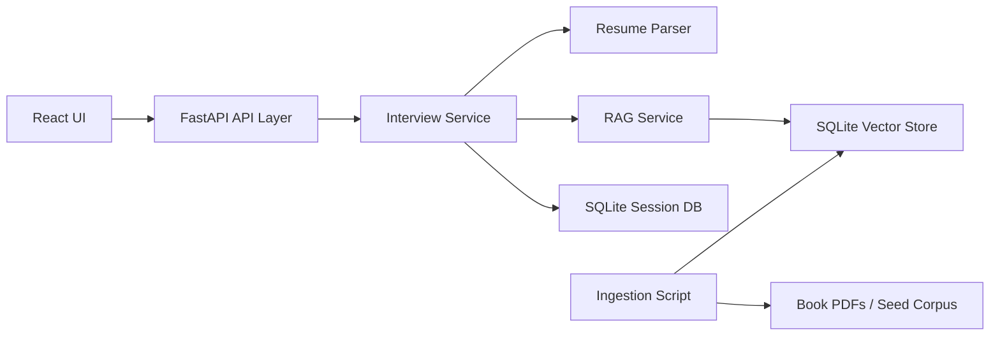

# Role-Based Candidate Screening RAG System

This project completes the AI/ML and Backend Intern assignment as a full-stack system. It simulates a structured technical interview where questions are generated from three signals: the uploaded resume, the selected role, and retrieved role-specific knowledge.

## Features

- Resume upload for PDF or text files.
- Role selection for AI/ML Engineer, Data Science / Applied ML, Backend Engineer for AI Systems, and Advanced / Theoretical ML.
- Resume parsing with skill and domain extraction.
- Retrieval-Augmented Generation pipeline with chunking, embeddings, vector search, and traceable context.
- Interactive interview sessions with persistent questions, answers, context, and scoring.
- Final structured summary with readiness band, strengths, gaps, recommendation, and traceability note.
- React frontend integrated with FastAPI backend.
- SQLite database for interview persistence and a separate SQLite vector store for knowledge chunks.

## Architecture



## Key Design Decisions

- **FastAPI backend:** keeps request validation, upload handling, and API contracts explicit.
- **Service-layer separation:** resume parsing, retrieval, generation, scoring, and persistence live in separate modules.
- **SQLite persistence:** simple to run locally while still satisfying durable storage for sessions, questions, answers, and reports.
- **SQLite vector store:** stores chunk embeddings as normalized vectors and performs cosine retrieval. This avoids external hosted vector database setup while preserving the vector database concept.
- **Deterministic local embeddings:** uses hashed lexical embeddings so the project runs without API keys or heavyweight model downloads.
- **Traceable generation:** each question stores retrieval query, retrieved chunk IDs, source titles, candidate signals, and keywords used for generation.
- **Book-source ingestion:** `backend/data/knowledge_sources.json` contains the PDF URLs embedded in the assignment. The ingestion script can download and ingest those resources.

## Setup

From the project root:

```bash
cd "/mnt/c/Users/aryan/OneDrive/Documents/New project/ai_ml_backend_assignment"
cp .env.example .env
python3 -m venv .venv
.venv/bin/python -m pip install -r backend/requirements.txt
```

Build the vector database:

```bash
.venv/bin/python backend/scripts/ingest.py
```

The command above loads the included seed corpus so the system works immediately. To ingest the assignment book PDFs too:

```bash
.venv/bin/python backend/scripts/ingest.py --download-books
```

For a faster book-ingestion demo, limit pages and sources:

```bash
.venv/bin/python backend/scripts/ingest.py --download-books --only-first 2 --max-pages 30
```

Install frontend dependencies:

```bash
cd frontend
npm install
```

## Running Locally

Backend:

```bash
cd "/mnt/c/Users/aryan/OneDrive/Documents/New project/ai_ml_backend_assignment"
.venv/bin/uvicorn app.main:app --app-dir backend --reload --host 127.0.0.1 --port 8000
```

Frontend:

```bash
cd "/mnt/c/Users/aryan/OneDrive/Documents/New project/ai_ml_backend_assignment/frontend"
npm run dev
```

Open `http://127.0.0.1:5173`.

## API Overview

- `GET /api/health` returns service status and number of knowledge chunks.
- `GET /api/roles` returns supported roles.
- `POST /api/sessions` starts an interview from a resume upload and selected role.
- `GET /api/sessions/{session_id}` returns current session state.
- `POST /api/sessions/{session_id}/answers` stores an answer, scores it, and returns the next question or summary.
- `GET /api/sessions/{session_id}/summary` returns the complete structured record.


```

To regenerate it while the backend and frontend are running:

```bash
.venv/bin/python backend/scripts/create_demo_video.py
```

If you want to record a manual browser walkthrough, record these steps:

1. Show the repository structure and README.
2. Run the ingestion script and show the knowledge chunk count.
3. Start the FastAPI backend.
4. Start the React frontend.
5. Upload `backend/data/sample_resume.txt`.
6. Select a role and start the interview.
7. Answer multiple generated questions.
8. Show retrieved context snippets and answer scoring.
9. Complete the interview and show the final summary.
10. Briefly show the stored session/traceability through the API docs at `http://127.0.0.1:8000/docs`.


